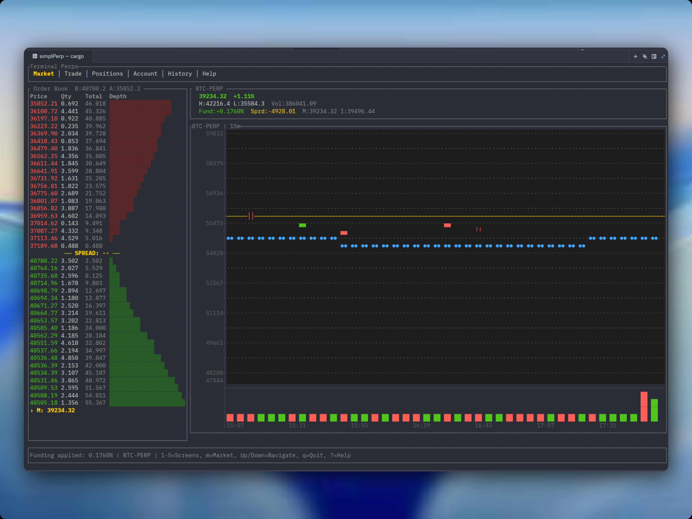

# Terminal Perps

A terminal-native perpetual futures DEX simulator. Trade BTC-PERP, ETH-PERP, and SOL-PERP with realistic synthetic market data, a full matching engine, margin system, and live candlestick charts — all from your terminal.



## What It Is

Terminal Perps is a standalone TUI (Terminal User Interface) application that simulates a perpetual futures trading environment. It runs entirely locally with no blockchain connection, using a deterministic stochastic price generator to create realistic 30-day market histories for each supported asset.

Think of it as a **flight simulator for crypto perp traders** — realistic enough to practice strategies, safe enough that you cannot lose real money.

## Core Features

### Markets
- **BTC-PERP** — Low volatility (~60% annualized), institutional-style price action
- **ETH-PERP** — Medium volatility (~75%), correlated to BTC with more wicks
- **SOL-PERP** — High volatility (~110%), meme-coin behavior with large moves

### Trading
- Market and limit orders
- Adjustable leverage (1x — 20x)
- Real-time PnL tracking
- Cross-margin collateral system
- Automatic liquidation at 5% maintenance margin
- Simulated funding payments every 60 seconds

### Charts
- **ASCII candlestick charts** with OHLCV data
- 2-character wide candles with horizontal grid lines
- Dynamic aggregation ensures ~22 readable candles regardless of timeframe
- Volume bars below price chart
- Multiple timeframes: 1m, 5m, 15m, 1h, 4h, 1D

### Market Data Engine
- **30-day synthetic history** generated on first launch using Geometric Brownian Motion with fat-tailed returns
- Fixed seeds (42/43/44) ensure identical charts every run
- Live price continuation from historical close
- Realistic volume clustering around volatility events

### Persistence
- User account state auto-saved
- Market history cached to disk after generation (~2 second first-run penalty, instant thereafter)

## Quick Start

### Requirements
- Rust toolchain (1.70+)
- Terminal with Unicode support

### Installation

```bash
git clone <repository>
cd terminal-perps
cargo run --release
```

On first launch, the app generates 30 days of 1-minute OHLCV data for all three markets (~2-3 seconds). Subsequent launches are instant.

## Controls

### Global
| Key | Action |
|-----|--------|
| `1` — `5` | Switch screens (Market, Trade, Positions, Account, History) |
| `m` | Cycle market: BTC → ETH → SOL |
| `?` | Help screen |
| `q` / `Ctrl+C` | Quit |

### Market Screen
| Key | Action |
|-----|--------|
| `↑` / `↓` | Select order in book |
| `t` | Cycle chart timeframe |
| `Enter` | Cancel selected order |

### Trade Screen
| Key | Action |
|-----|--------|
| `↑` / `↓` | Navigate form fields |
| `Space` | Toggle Buy/Sell or Market/Limit |
| `Enter` | Edit value (Price/Size/Leverage) or toggle enum |
| `0-9` / `.` | Type numeric values |
| `Backspace` | Delete last character |
| `Enter` | Confirm edit |
| `Esc` | Cancel edit |
| `s` | Submit order |

### Account Screen
| Key | Action |
|-----|--------|
| `d` | Deposit fake USDC |
| `w` | Withdraw fake USDC |

## Quick Trade Workflow

1. Press `4` → Account → `d` → type `10000` → Enter (deposit)
2. Press `2` → Trade screen
3. `↑`/`↓` to navigate fields, `Space` to toggle side/type
4. Navigate to Size, press `Enter`, type `0.5`, press `Enter`
5. Press `s` to submit
6. Press `3` to watch live PnL and liquidation price
7. Press `m` at any time to switch markets

## Architecture

```
terminal-perps/
├── src/
│   ├── main.rs              # Terminal bootstrap, panic hook
│   ├── app.rs               # App state, input routing, screen management
│   ├── events.rs            # Async event loop (tokio + crossterm)
│   ├── user.rs              # Account, positions, margin & PnL math
│   ├── persistence.rs       # Save/load state to JSON
│   ├── engine/
│   │   ├── simulator.rs     # Deterministic price history generator
│   │   ├── market.rs        # Per-market state (book, oracle, chart)
│   │   ├── candles.rs       # OHLCV aggregation and timeframe logic
│   │   ├── orderbook.rs     # BTreeMap-based L2 order book
│   │   ├── matcher.rs       # FIFO order matching with partial fills
│   │   ├── oracle.rs        # Mark/index price tracking
│   │   ├── liquidator.rs    # Automatic liquidation engine
│   │   └── funding.rs       # Periodic funding rate payments
│   └── ui/
│       ├── chart.rs         # ASCII candlestick renderer
│       ├── market.rs        # Order book + chart + trades layout
│       ├── trade.rs         # Interactive order form
│       ├── positions.rs     # Open positions table
│       ├── account.rs       # Balance display
│       └── history.rs       # Fill history table
└── Cargo.toml
```

## Technical Highlights

- **Exact arithmetic**: All prices, sizes, and PnL use `rust_decimal` to avoid floating-point errors
- **Deterministic simulation**: Fixed seeds mean identical market data every run — reproducible for strategy testing
- **Stochastic volatility**: Returns drawn from fat-tailed distributions (not simple normal) for realistic crypto wicks
- **Async TUI**: `tokio` drives the event loop while `ratatui` + `crossterm` handle rendering at ~10 FPS
- **Modular engine**: Each market is self-contained; adding a new perp is ~5 lines

## Why Synthetic Data?

Fetching real exchange data would make this a thin client for an existing API. Synthetic data gives us:
- **Determinism** — same charts every run for reproducible practice
- **No API keys or rate limits**
- **Full offline operation**
- **Controlled volatility profiles** — each market behaves distinctly
- **30 days of history on launch** — no empty "waiting for data" state

## Future Improvements

- [ ] Trade execution markers on chart (▲/▼ at fill price)
- [ ] Zoom and pan chart with `+`/`-` and arrow keys
- [ ] Crosshair mode for exact candle inspection
- [ ] Portfolio correlation view
- [ ] More markets (ARB, OP, etc.)

## License

MIT
